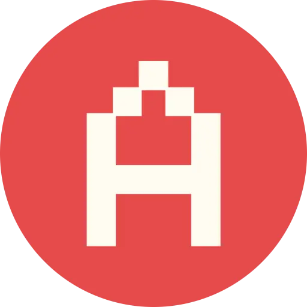

  <section id="banner"></section>
  <header id="hero">
    <!--Avatar and Note-->
    <section id="avatarNnote">
      

      <audio id="music" src="assets/audio/music.mp3" loop></audio>
      <aside id="bubble">
        

          

          
{{ site.note }}

      </aside>
    </section>
    
    <!--Name and Email-->
    <section id="plate">
      

        <h1 id="name"><a href="/">{{ site.name }}</a></h1>
        
      

      

        <a href="mailto: {{ site.email }}" id="mailID">{{ site.email }}</a>
      

    </section>
  </header>

  <address>
    <a href="https://github.com/srikanth9x" target="_blank" id="github" class="icon">
      <i class="iconoir-github"></i>
    </a>
    <a href="{{ '/feed.xml' | relative_url }}" target="_blank" id="feed" class="icon">
      <i class="iconoir-rss-feed"></i>
    </a>
    <a href="https://x.com/srikanth9x" target="_blank" id="x" class="icon">
      <i class="iconoir-x"></i>
    </a>    
    <a href="https://linkedin.com/in/srikanth9x" target="_blank" id="linkedin" class="icon">
      <i class="iconoir-linkedin"></i>
    </a>
    <a href="https://youtube.com/@srikanth9x" target="_blank" id="youtube" class="icon">
      <i class="iconoir-youtube"></i>
    </a>
    <a href="https://instagram.com/srikanth9x" target="_blank" id="instagram" class="icon">
      <i class="iconoir-instagram"></i>
    </a>
  </address>
  
  <!--About-->
  <section class="card" id="meIn3Secs">
    <h2 class="cardTitle">Me in 3 seconds</h2>
    
{{ site.description }}

    <a href="/about" class="cardAction">
      
me in 3 minutes
        <i class="iconoir-arrow-up-right"></i>
      

    </a>
  </section>

  <!--Now-->
  <section class="card">
    <h2 class="cardTitle">What I'm doing now?</h2>
    <a href="/now" class="cardAction">
      
have a look
        <i class="iconoir-arrow-up-right"></i>
      

    </a>
  </section>
 
 <!--   
 "Friends" - Temporary Drop-OFF
 
  <a href="/friends" class="card link" id="friends">
    
Friends

    <i class="iconoir-arrow-up-right"></i>
  </a>
  -->
  
  <!--Projects-->
  <section class="card" id="projects">
    <h2 class="cardTitle">Projects</h2>
    
    
    
    
      
      <a href="{{ url }}" class="project" id="{{ project.slug }}">
      
      

        {{ project.title }}
        <i class="iconoir-arrow-up-right"></i>
      

      </a>
    
     
    <a href="/projects" class="cardAction">
      
more here
        <i class="iconoir-arrow-up-right"></i>
      

    </a>
  </section>
  
  <footer class="card">
    
&copy; 2026 Bandari Srikanth

  </footer>
  <section id="popup">
    

    

  </section>

